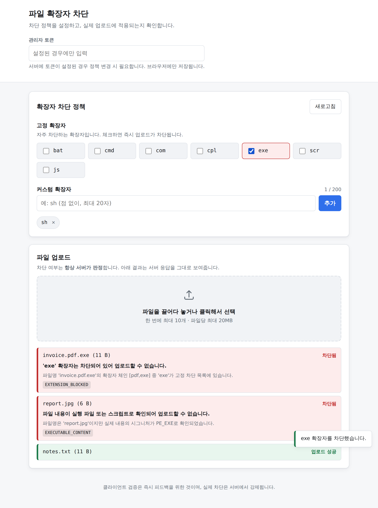

# 파일 확장자 차단 시스템

확장자 차단 정책을 관리하고, **그 정책이 실제 파일 업로드에 강제되는** 시스템입니다.



## 핵심

정책 화면만 있고 실제 업로드에 적용되지 않으면 의미가 없습니다. 이 프로젝트의 합격선은 한 문장입니다.

> `exe` 체크박스를 켜면, **바로 다음 업로드부터** 같은 파일이 거부된다.

이것을 세 계층에서 증명합니다.

| 계층 | 검증 |
|---|---|
| 통합 테스트 | `UploadEnforcementIntegrationTest#policyChangeTakesEffectOnTheNextUpload` |
| API (curl) | `scripts/verify.sh` 2절 `[CORE]` — 클라이언트를 완전히 우회 |
| 브라우저 | `scripts/ui-verify.mjs` 3절 `[CORE]` — 실제 Chromium |

## 기술 스택

| 영역 | 선택 | 근거 |
|---|---|---|
| API | Spring Boot 4.1.1 / Java 21 | 3.5는 2026-06-30 OSS EOL. 4.1은 2027-07-31까지 지원 |
| DB | MySQL 8.4 (테스트·개발은 H2 MySQL 모드) | CHECK 제약(8.0.16+)이 고정 확장자 방어의 한 층 |
| 프론트 | 바닐라 JS, **런타임 의존성 0** | 클라이언트 검증은 어차피 신뢰 불가 → 라이브러리 이득이 작음 |
| 배포 | 프론트 Vercel / 백엔드 기존 OCI 재사용 | 무료 MySQL을 주는 PaaS가 사실상 없음 |

각 선택의 상세 근거는 **[docs/01-decisions.md](docs/01-decisions.md)** 에 있습니다.

## 빠른 시작

MySQL도 Docker도 필요 없습니다.

```bash
# 백엔드 (H2 인메모리 + 운영과 동일한 Flyway 마이그레이션)
#   EXTGUARD_ADMIN_TOKEN을 주어 관리자 가드를 켠 채로 띄웁니다 — 운영과 같은 모양이고,
#   끄면 정책 쓰기가 무인증이 되어 권한 관련 동작을 아예 잴 수 없습니다.
cd backend && EXTGUARD_ADMIN_TOKEN=test-secret \
  ./gradlew bootRun --args='--spring.profiles.active=dev'

# 프론트엔드 (별도 터미널)
cd frontend && python3 -m http.server 8081
```

http://localhost:8081 을 엽니다.

> `index.html`의 `api-base` 태그에는 **배포된 API 주소**가 들어 있습니다. Vercel이 빌드 단계
> 없이 이 파일을 그대로 내기 때문입니다. 그래서 **로컬에서 연 페이지는 그 태그를 무시하고**
> `http://localhost:8080`을 씁니다 — 위에서 띄운 백엔드입니다. 그러지 않으면 로컬 백엔드를
> 띄워 두고 브라우저는 운영 API를 부르게 됩니다.
>
> 다른 주소를 쓰려면 `?api=`를 붙입니다. 예: http://localhost:8081/?api=http://localhost:9000
> 이 덮어쓰기는 **로컬에서 연 페이지에만** 적용됩니다(`frontend/src/config.js` 참고).

화면 우측 상단 **「관리자 토큰」**에 위 `test-secret`을 넣으세요. 정책 변경은 그 토큰을 요구합니다 — 넣지 않으면 체크박스를 눌러도 "관리자 토큰이 필요합니다"가 뜹니다.

직접 해볼 것: `.exe` 파일을 업로드해 성공하는지 보고 → `exe` 체크박스를 켠 뒤 → 같은 파일을 다시 올려보세요.

## 검증

위 빠른 시작대로 **가드를 켠 서버**를 띄워 두고, 같은 토큰으로 돌립니다.

```bash
# 저장소 루트에서. 첫 줄을 subshell로 감싼 것은 cd가 셸에 남으면
# 뒤의 두 줄이 backend/scripts/를 찾기 때문입니다.
(cd backend && ./gradlew test)                                 # 단위·통합 테스트
ADMIN_TOKEN=test-secret scripts/verify.sh                      # API 엔드투엔드
ADMIN_TOKEN=test-secret node scripts/ui-verify.mjs             # 브라우저 (playwright 필요)
```

토큰을 빠뜨리면 뒤의 둘이 실패합니다. `verify.sh`는 정책 변경이 401이 되고, 브라우저 검증은 **권한 없는 쓰기를 재는 절**이 서버 가드가 꺼져 있으면 잴 것이 없어집니다.

> CI는 앞의 두 계층만 돌립니다. **브라우저 계층은 CI에 없으므로**(`.github/workflows/ci.yml` 머리말) "CI 초록"이 브라우저 검증까지 덮는다는 뜻은 아닙니다.

검증 건수는 [`docs/00-requirements-traceability.md`](docs/00-requirements-traceability.md)의 「검증 총계」 한 곳에서만 관리합니다.

## 구조

```
backend/     Spring Boot · 검증 로직은 upload/validation/ 에 집중
frontend/    바닐라 JS ES 모듈 · 빌드 단계 없음
deploy/      docker-compose (app + MySQL + Caddy) · OCI용
docs/        판단 근거 · 요구사항 추적 · API · 배포
scripts/     verify.sh (API) · ui-verify.mjs (브라우저)
```

## 무엇을 막는가

확장자 문자열만 믿지 않습니다.

| 시도 | 결과 |
|---|---|
| `virus.exe` (exe 차단 시) | `EXTENSION_BLOCKED` |
| `VIRUS.EXE` | 차단 — NFKC + `Locale.ROOT` 정규화 |
| `ＥＸＥ` (전각) | 차단 — 동형 문자 접힘 |
| `invoice.pdf.exe` | 차단 — 확장자 체인 `[pdf, exe]` 전체 검사 |
| `evil.exe.` (후행 점) | 차단 — Windows가 점을 지우기 전에 먼저 제거 |
| `report.jpg` (내용은 PE 바이너리) | `EXECUTABLE_CONTENT` — 매직 넘버로 위장 탐지 |
| `payload` (확장자 없는 PE 바이너리) | `EXECUTABLE_CONTENT` — 확장자가 없으면 정책이 손댈 수 없음 |
| `setup.exe` (PE 시그니처, exe 미체크) | **허용** — 정직하게 이름 붙은 파일은 확장자 정책이 판단 |
| `avatar.png` (내용에 `<?php`) | `EXECUTABLE_CONTENT` — 폴리글롯 웹셸 |
| `../../etc/passwd` | 경로 성분 제거. 저장 경로에 사용자 입력이 아예 들어가지 않음 |
| `CON.txt` | `FILENAME_RESERVED` |
| `.env` | 체인 `[env]`로 취급되어 차단 대상이 될 수 있음 |

거부는 항상 **무엇이·왜** 막혔는지 함께 알려줍니다.

```
'exe' 확장자는 차단되어 있어 업로드할 수 없습니다.
파일명 'invoice.pdf.exe'의 확장자 체인 [pdf,exe] 중 'exe'가 고정 차단 목록에 있습니다.
EXTENSION_BLOCKED
```

## 설계에서 눈여겨볼 지점

**고정 확장자는 데이터가 아니라 코드입니다.** 7개 목록은 `FixedExtensions.ALL` 상수이고, DB에는 토글 상태만 있습니다. 누가 DB 행을 지워도 화면은 여전히 체크박스 7개를 그립니다. 여기에 리포지토리 분리·CHECK 제약 2종·DB 권한 축소를 더해 네 겹으로 막았습니다. 이 설계는 리뷰 지적으로 바뀐 것이며 경위는 [docs/01-decisions.md 1절](docs/01-decisions.md)에 있습니다.

**MIME 타입으로는 아무것도 판단하지 않습니다.** 브라우저가 보내는 `Content-Type`은 공격자가 바꿀 수 있고 정상 파일에서도 자주 틀립니다. 거부 근거로 쓰면 보안은 안 늘고 오탐만 늡니다. 기록만 하고 판단은 내용 시그니처로 합니다.

**내용 검사는 "위장"만 잡습니다.** 내용이 PE인 파일이 정직하게 `.exe`라고 이름 붙어 있으면 확장자 정책이 판단합니다. 그러지 않으면 `exe` 체크를 해제해도 실행 파일이 계속 막혀서, 체크박스가 지키지 못할 약속을 하게 됩니다. 확장자가 아예 없는 실행 파일은 정책이 손댈 대상이 없으므로 그대로 거부합니다.

**클라이언트는 차단 대상인 걸 알아도 요청을 보냅니다.** 화면에 뜨는 판정은 언제나 서버 응답입니다. 클라이언트가 막아버리면 서버가 강제한다는 사실이 증명되지 않기 때문입니다.

## 문서

| 문서 | 내용 |
|---|---|
| [00-requirements-traceability.md](docs/00-requirements-traceability.md) | 요구사항 → 구현 파일 → 테스트 대조표 |
| [01-decisions.md](docs/01-decisions.md) | 판단 근거, 리뷰로 바로잡은 항목, 고려사항별 결론 |
| [02-tooling.md](docs/02-tooling.md) | 사용한 스킬·MCP·라이브러리와 그 용도 |
| [03-api.md](docs/03-api.md) | API 레퍼런스 |
| [04-deployment.md](docs/04-deployment.md) | Vercel + OCI 배포, OCI 함정 포함 |

## 범위 밖

업로드 파일 다운로드 엔드포인트(되돌려주는 것이 실제 위험 지점), 바이러스 스캔 연동, 사용자별 정책, 화이트리스트 전환, 고아 파일 정리 잡, 정식 로그인. 각각의 확장 지점은 [docs/01-decisions.md 4-3](docs/01-decisions.md)에 기술했습니다.
